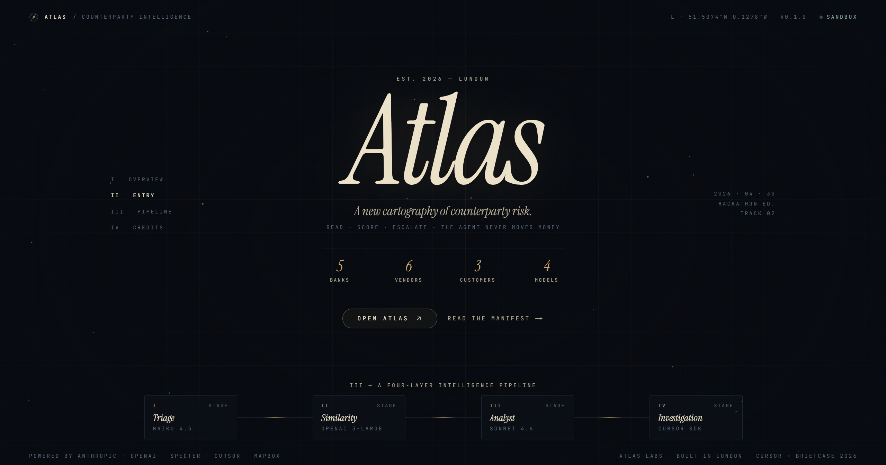
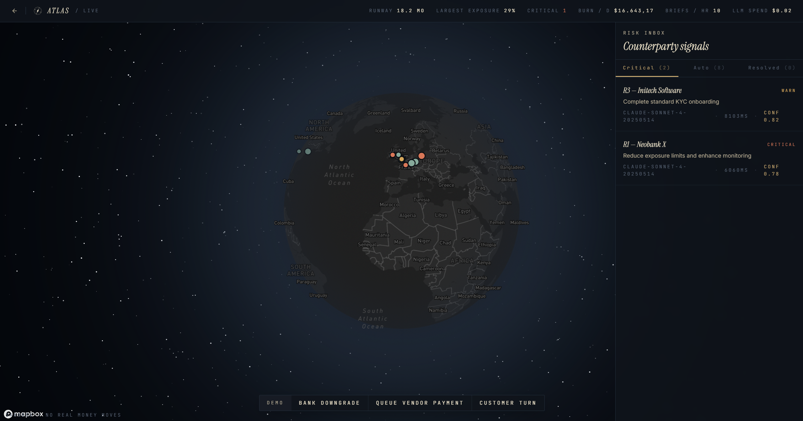
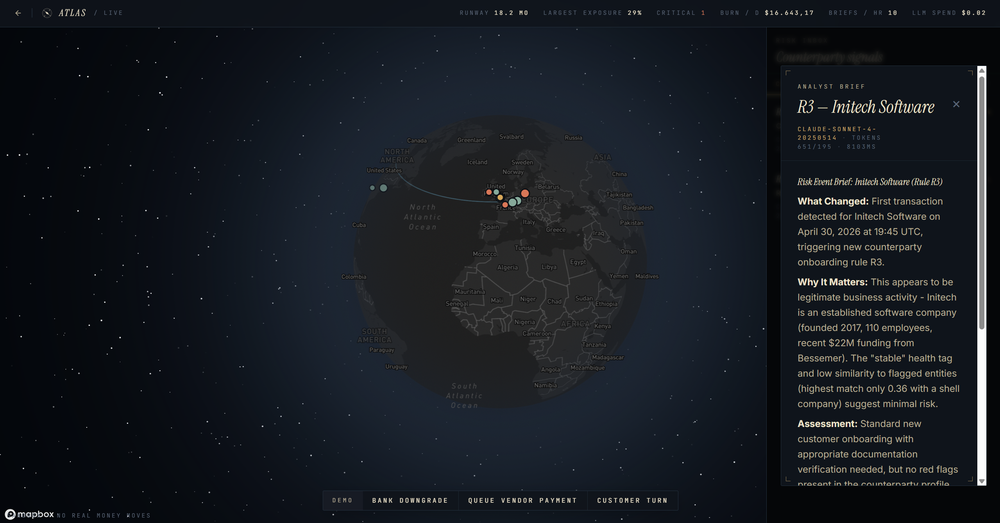
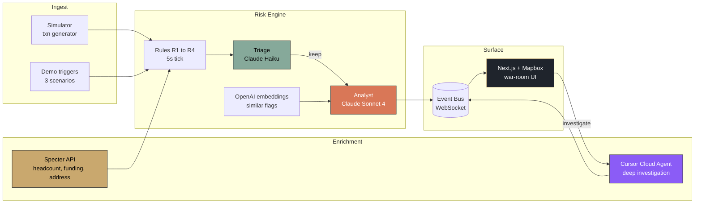

<div align="center">

# Atlas

### A new cartography of counterparty risk.

Real-time treasury intelligence: read every transaction, score every counterparty, brief every decision.

[](https://nextjs.org/)
[](https://fastapi.tiangolo.com/)
[](https://www.typescriptlang.org/)
[](https://www.python.org/)

[](https://www.anthropic.com/)
[](https://platform.openai.com/)
[](https://cursor.com/)
[](https://www.mapbox.com/)
[](https://tryspecter.com/)

[](https://cursor.com/)
[](#)
[](#license)

<br />



</div>

---

## Overview

Atlas is a treasury control room. It watches every counterparty a company touches (banks, vendors, customers) and continuously asks one question:

> *Should anyone in finance know about this in the next 30 seconds?*

Transactions flow in. Rules fire. Two LLMs collaborate: Haiku triages signals at scale, Sonnet writes a forensic brief for the ones that matter. Specter enriches every counterparty with public-record signals (headcount deltas, funding events, shell-address proximity). When something demands deeper investigation, a Cursor Cloud Agent spawns in the background and streams its tool calls live into the UI.

Humans decide. The agent never moves money.

---

## Highlights

- **Live globe.** Every counterparty plotted with a health-tag halo, real-time pulses on new events, and animated transaction flows.
- **Hybrid risk pipeline.** Four deterministic rules (R1 to R4) feed a Haiku triage layer, which escalates signals to a Sonnet analyst that produces a markdown brief, a recommended action, and similar-prior-flag retrieval via OpenAI embeddings.
- **Cursor Cloud investigation.** One click spawns a background agent that runs Specter lookups and web searches, then drops a forensic memo as a downloadable artifact.
- **Sub-second WebSocket bus.** Events stream from the Python pipeline to the Next.js UI as they happen.
- **Old-map aesthetic.** Instrument Serif and JetBrains Mono, brass corner ticks, dark cartography. No generic dashboard chrome.
- **Sandbox by design.** The agent never executes a transfer; every recommendation is a memo for a human.

---

## Screenshots

<table>
<tr>
<td width="50%">

**War room.** Globe, top-bar metrics, risk inbox.



</td>
<td width="50%">

**Brief modal.** Sonnet 4 analysis with citations.



</td>
</tr>
</table>

---

## Architecture



Three services, one pipeline:

| Service | Stack | Port | Role |
|---|---|---|---|
| `web/` | Next.js 14, Tailwind, Mapbox GL, Framer Motion | `:3000` | Landing page and war-room dashboard |
| `api/` | FastAPI, SQLAlchemy, SQLite, WebSocket | `:8000` | Rule engine, LLM workers, event bus |
| `agent-svc/` | Express, `@cursor/sdk` | `:8001` | Cursor Cloud Agent sidecar |

---

## Quickstart

### Prerequisites
- Node.js 22 or higher
- Python 3.11 or higher
- API keys (all optional; the system runs in fallback mode without them):
  - Anthropic, OpenAI, Specter, Cursor, Mapbox

### Install
```bash
git clone https://github.com/omorros/Atlas.git && cd Atlas
npm install
npm --prefix web install
npm --prefix agent-svc install
pip install -r api/requirements.txt
```

### Configure
Copy each `.env.example` to `.env` and fill in what you have:
```bash
cp .env.example .env
cp api/.env.example api/.env
cp web/.env.example web/.env
cp agent-svc/.env.example agent-svc/.env
```

### Run
```bash
npm run dev
```

This spawns the api on `:8000`, the web app on `:3000`, and the agent sidecar on `:8001` via `concurrently`.

Open http://localhost:3000 for the landing, or http://localhost:3000/app for the war room.

---

## Demo

The bottom Demo Dock has three scripted scenarios. Click any to see the full pipeline fire end to end:

| Trigger | What happens | Rule fired |
|---|---|---|
| Bank downgrade | Neobank X (Berlin) flips to fragile. Sonnet drafts a runway-impact brief. | R1 (Specter delta) |
| Queue vendor payment | A 180,000 EUR payment to a new shell-address vendor in Dublin gets queued. R3 and R4 fire; brief recommends freeze. | R3 + R4 |
| Customer turn | Globex receivable goes overdue. Exposure shifts, runway drops live. | R2 (standing exposure) |

Each click produces: globe pulse, new brief in the inbox after roughly 6 seconds (real Sonnet call), brief modal with markdown body, similar prior flags, and a recommended action. From the modal, clicking "Investigate further" opens the Cursor Cloud Agent panel, which streams tool calls and drops a memo artifact.

CLI alternative:
```bash
npm run demo:bank
npm run demo:vendor
npm run demo:customer
```

---

## Tech Stack

<table>
<tr><td><b>Frontend</b></td><td>

Next.js 14, React 18, TypeScript, Tailwind CSS, Mapbox GL JS, Framer Motion, React Markdown, Lucide

</td></tr>
<tr><td><b>Backend</b></td><td>

FastAPI, SQLAlchemy (async), aiosqlite, Pydantic, `websockets`, `httpx`

</td></tr>
<tr><td><b>AI and intelligence</b></td><td>

Anthropic Claude (Haiku 4.5 triage and Sonnet 4 analyst), OpenAI `text-embedding-3-large`, Cursor SDK Cloud Agents, Specter REST

</td></tr>
<tr><td><b>Infrastructure</b></td><td>

`concurrently` for one-command dev, `tsx watch`, `uvicorn --reload`, in-process EventBus with WebSocket fan-out

</td></tr>
</table>

---

## Project Structure

<details>
<summary>Click to expand</summary>

```
Atlas/
├── api/                    # FastAPI backend and risk engine
│   ├── app/
│   │   ├── main.py         # Entrypoint, lifespan, routers
│   │   ├── routers/        # /state, /demo, /risk-events, /events/stream (WS)
│   │   ├── rules/          # R1 to R4 rule engine
│   │   ├── workers/        # Haiku triage, Sonnet analyst, embeddings
│   │   ├── specter/        # Specter REST client
│   │   ├── risk_pipeline.py# 5s tick: triage, analyst, persist, WS broadcast
│   │   └── simulator.py    # Background transaction generator
│   └── data/radar.db       # SQLite (auto-seeded from fixtures)
│
├── web/                    # Next.js 14 frontend
│   ├── app/
│   │   ├── page.tsx        # Landing
│   │   └── app/page.tsx    # War room
│   └── components/
│       ├── Globe.tsx       # Mapbox globe and pulse layers
│       ├── TopBar.tsx      # Live metrics
│       ├── RiskInbox.tsx   # Brief feed (Critical, Auto, Resolved)
│       ├── BriefModal.tsx  # Sonnet brief detail
│       ├── DemoDock.tsx    # 3 trigger buttons
│       └── InvestigationPanel.tsx  # Cursor agent stream
│
├── agent-svc/              # Node sidecar (Cursor SDK)
│   └── src/investigate.ts  # Spawns Cursor Cloud Agent, streams events
│
├── shared/
│   ├── types.ts            # TS contracts
│   ├── schemas.py          # Pydantic mirror
│   └── fixtures.json       # Seed data (counterparties, accounts, txns, Specter profiles)
│
├── PRD.md                  # Full product spec
└── docs/screenshots/       # README assets
```

</details>

---

## Reset and debug

```bash
# Wipe local DB and reseed from fixtures
rm api/data/radar.db && cd api && python -m app.seed

# Run individual services
npm run dev:api
npm run dev:web
npm run dev:svc

# Smoke tests
curl http://localhost:8000/health
curl http://localhost:8000/state | jq
curl -X POST http://localhost:8000/demo/trigger/bank-downgrade
```

---

## Team

Built in 48 hours at Cursor x Briefcase London 2026 by a four-person team.

| Owner | Subsystem |
|---|---|
| A | Backend spine: FastAPI, DB, simulator, event bus, WebSocket |
| B | Risk engine: rules R1 to R4, Haiku triage, Sonnet analyst, embeddings |
| C | Frontend: Mapbox globe, war-room UI, Cursor investigation panel |
| D | Integrations: Specter enrichment, Cursor Cloud Agent sidecar |

---

## License

Hackathon project. All rights reserved until further notice.

<div align="center">

---

*Sandbox. No real money moves.*

</div>
